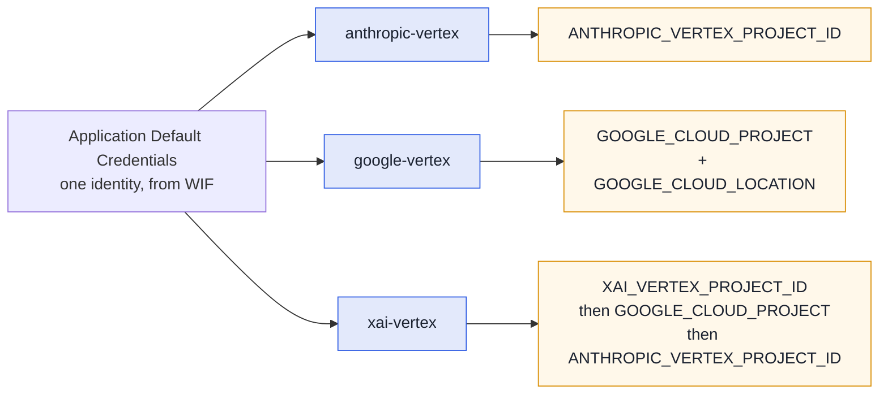

# Pi

[pi](https://github.com/earendil-works/pi) is fullsend's second agent runtime, opt-in per org or
repo. It reaches models Claude Code cannot — **Grok** and **Gemini** alongside Claude — through the
same sandbox, credentials and egress policy.

```bash
fullsend run triage --runtime pi --model xai-vertex/xai/grok-4.6
```

Selecting it, and how it compares to Claude Code, is in [Agent runtimes](../runtimes.md). This page
is what changes once you are on it.

## Models and providers

A model on pi is `provider/id`. Aliases and bare ids still work — `opus`/`sonnet`/`haiku` resolve
through fullsend's table, and a bare id gets the provider from `FULLSEND_PI_PROVIDER` (default
`anthropic-vertex`).

| Model | Spec | Provider |
|---|---|---|
| Claude | `anthropic-vertex/claude-opus-4-6` | vendored extension |
| Gemini | `google-vertex/gemini-3.7-flash` | pi built-in |
| Grok | `xai-vertex/xai/grok-4.6` | vendored extension |
| GPT | `openai/gpt-5.6-luna` | pi built-in |

> **Grok's spec has three segments on purpose.** pi sends the model id on the wire verbatim and
> Vertex wants the publisher-qualified `xai/grok-4.6`, so the id keeps its slash. Use the full
> `xai-vertex/xai/grok-4.6`; a bare `xai/grok-4.6` would otherwise reach pi's **built-in** `xai`
> provider, which talks to xAI's own API and wants `XAI_API_KEY`. fullsend normalises the short form
> and a bare id under `FULLSEND_PI_PROVIDER=xai-vertex`, case-insensitively, so both land on the
> canonical spec.

> **GPT via OpenAI** needs no API key in CI: the runner exchanges the job's GitHub identity for a
> short-lived OpenAI token (give fullsend three identifiers with `fullsend github setup --openai-*`
> or repository variables — see [OpenAI Workload
> Identity](../guides/infrastructure/openai-workload-identity.md); GitHub Actions only) and keeps it
> in a provider that belongs to this run, refreshed before it expires and removed when the run
> ends. Locally, put `OPENAI_API_KEY` in an env file for the runner ([Running agents
> locally](../guides/user/running-agents-locally.md#get-an-openai-key-gpt-on-pi-only)). Declare
> `providers: [openai]` on the harness; the sandbox can then reach `api.openai.com` for the
> Responses API and nothing else, and never sees the credential
> ([ADR 0092](../ADRs/0092-openai-wif-credential-delivery.md)). A custom harness must carry a
> `policy:` (the fleet's `policies/base.yaml`); without one the image's default policy leaves an
> uninspected route to `api.openai.com` and the run stops before the agent starts. **Exercised so
> far:** the local static-key path end to end on 2026-08-27 (OpenShell 0.0.115, pi 0.84.3,
> `gpt-5.6-luna`: placeholder in the sandbox, pi reading it from the runner-seeded `auth.json`, tool
> calls through the hook adapter, run-scoped provider deleted at the end, expired in place under
> `--keep-sandbox`), plus the placeholder-generation experiments recorded in the ADR. The WIF path
> has no live run yet; `features/runtime/pi-openai.feature` stays gated on `runtime-pi-openai`
> until an OpenAI organization is mapped to the test org repositories.

Harness `model:` and `agents:` entry `model:` values accept the `provider/id` form directly
(`xai-vertex/xai/grok-4.6`); a harness can also select a provider with a bare `model:` plus
`FULLSEND_PI_PROVIDER`.

### Each provider has its own GCP project

Every Vertex provider on pi resolves its **own** project variable, so one run can reach models that
live in different projects. That matters because Model Garden availability is per-project — Grok may
well be enabled somewhere other than Claude.



ADC supplies the identity for all three — only the *project* differs, so one credential covers them.
A pi run leaves an explicitly-set `XAI_VERTEX_PROJECT_ID` alone and only defaults it to the fleet's
Vertex project, so Grok can be pointed at a project where it is actually enabled.

**Endpoints and regions.** `anthropic-vertex` uses `CLOUD_ML_REGION` (then `GOOGLE_CLOUD_LOCATION`).
`xai-vertex` is fixed to the **global** endpoint — Vertex serves Grok only there, and regional
endpoints answer `FAILED_PRECONDITION` — so region variables are deliberately ignored for it.

## At a glance

| | |
|---|---|
| Credentials | Same WIF `external_account` + refreshed OIDC token as Claude Code for Vertex providers. `ANTHROPIC_*` unset on the Claude provider, `XAI_API_KEY` unset on the Grok one; `OPENAI_BASE_URL`/`AZURE_OPENAI_API_KEY` unset on the OpenAI one. OpenAI uses a runner-exchanged WIF token (ADR 0092) |
| Unattended | No approval prompts, stdin closed, bounded retries; a missing credential exits 1 |
| Artifacts | `output.jsonl`, `transcripts/<agent>-<ts>_<id>.jsonl`, `metrics.json` with `runtime: pi`, plus `pi-debug.log` with `--debug` |
| Extra knobs | `FULLSEND_PI_PROVIDER` (prefix for bare ids), `FULLSEND_PI_BASH_ALLOWLIST=enforce` |
| Not supported | Sub-agents, fallback chains, `plugins:`, Bedrock/Azure providers |

## Running it locally

Complete [Running agents locally](../guides/user/running-agents-locally.md) first — the CLI,
OpenShell, credentials and the fleet clone are the same. Every example there runs on pi by adding
`--runtime pi` to the same command:

```bash
fullsend run triage \
  --fullsend-dir /tmp/fullsend-agents/ \
  --target-repo /tmp/target-repo/ \
  --env-file fullsend-gcp.env \
  --env-file fullsend-triage.env \
  --runtime pi
```

The plan block confirms the selection — overridden values carry their source, harness defaults
print bare — and `metrics.json` records the same (`runtime`, `runtime_source`, `requested_model`,
`override_source`):

```
    Model: opus
    Effort: high
    Runtime: pi (from --runtime flag)
...
runtime: selected "pi" from --runtime flag
...
→ Agent: claude-opus-4-6 (v0.84.2)
→ Result: stop
  ✓ Agent exited with code 0 (131.9s)
```

Pick a model the same way — on pi the model name is also the provider choice, and the same Vertex
credentials cover Gemini:

```bash
fullsend run triage ... --runtime pi --model google-vertex/gemini-3.7-flash
```

To keep an agent on pi (or off it) without passing flags every time, set `runtime:`/`model:` on
its `agents:` entry in `config.yaml` — see [per-agent settings](../runtimes.md#per-agent-runtime-model-and-effort).

What a local pi run needs, beyond the guide:

- **fullsend v0.37.0+** — the first release that carries the pi runtime; the release download
  and the container image both work as-is.
- **A sandbox image that includes pi** — `ghcr.io/fullsend-ai/fullsend-sandbox` v0.37.0+ (the image
  bakes `PI_VERSION`). A stale image fails preflight with `pi preflight: pi --version exited 127`;
  `podman pull ghcr.io/fullsend-ai/fullsend-sandbox:latest` fixes it.
- **Platforms** — verified end to end on macOS Apple Silicon (podman machine, Homebrew `openshell`)
  and Fedora with rootless Podman; the guide's platform notes apply unchanged.
- **`review` and `retro`** complete with schema-valid results but in a single context — pi has no
  sub-agent tool, so the parallel reviewer roster is not exercised (see [Not yet exercised](#not-yet-exercised)).
- **Knobs** — `FULLSEND_PI_PROVIDER` sets the provider for bare model ids (default
  `anthropic-vertex`); `FULLSEND_PI_BASH_ALLOWLIST=enforce` makes the Bash first-token allowlist
  block instead of warn.
- **Security hooks are fail-closed** — a missing or modified hook adapter stops the run with exit
  97 by design; repo-owned `.pi/` content is never loaded.
- **Debugging** — `--debug='*'` (the `=` is required); sandbox-side failures land in `pi-debug.log`
  inside the run directory, next to the transcripts, not in the runner's output.

## Behaviour differences worth knowing

- **No permission system.** pi's posture is "run in a container". The sandbox, its egress policy and
  credential placeholders are the boundary ([ADR 0027](../ADRs/0027-allowed-and-disallowed-tools-for-agents.md));
  fullsend's hook adapter is defense-in-depth on top.
- **Reads `AGENTS.md` natively** — no `CLAUDE.md` bridge is injected.
- **The agent body is appended** to pi's own system prompt rather than replacing it, so pi's default
  tool guidance stays. Claude Code's `--agent` replaces it.
- **`--tools` is enforced strictly**, unlike Claude Code. `Bash(a,b)` becomes a first-token allowlist
  that is advisory by default; `FULLSEND_PI_BASH_ALLOWLIST=enforce` makes it block.
- **Failed tool calls are sanitized too** — pi fires its post-tool event on failures, which Claude
  Code does not, so redaction and unicode normalization apply on both paths.
- **Fast release cadence** (~weekly minors, with wire-format changes inside a minor) — versions are
  pinned exactly and the stream-parser fixtures are tied to the pinned version.

## Not yet exercised

`runtime: pi` is selectable and has been run end to end, but no **fleet lifecycle** run on Vertex is
recorded yet. Pilot on a disposable repo with `triage`/`prioritize` before `code`/`fix`. `review` and
`retro` run to schema-valid results, but in a **single context**: pi has no sub-agent tool, so the
parallel persona roster and its per-persona models are never exercised — treat them as unsupported
for that purpose. `extension_error` events are not mapped.

## Troubleshooting

**The model is not found, or the provider is missing.** A pi provider comes from an extension loaded
with `-e`, and a failed extension is dropped **silently** — it simply does not appear. Re-run with
`--debug` and read `pi-debug.log`, which captures pi's stderr including extension load errors.

**`No API key found for <provider>`.** The provider is registered but its credentials did not
resolve. For Vertex providers that means ADC — check the project variable for *that* provider in the
table above, not a shared one.

**403 `PERMISSION_DENIED` on a Vertex call.** The credentials work but the model is not enabled in
that project's Model Garden, or the provider resolved a different project than you expect.

**`[pi-anthropic-vertex] disabled: set GOOGLE_CLOUD_PROJECT ...`.** The sandbox environment comes
from the harness (`host_files`, `env.sandbox`), not from `--env-file`, which only reaches the runner
process (ADR 0055). Files sourced from `.env.d/` need `export` on each line. The fleet harnesses
already wire this; a custom harness must too.

**The run used Claude instead of pi.** The runtime falls back to `claude` when neither the config's
`runtime:` (repo-wide or on the agent's `agents:` entry) nor `--runtime`/`FULLSEND_RUNTIME` selects
pi; the plan block's `Runtime:` line and stderr's `runtime: selected ...` show which one ran and why.

**`--debug "..."` fails with `accepts 1 arg(s)`.** `--debug` takes an optional value: write
`--debug='*'` (with `=`).

**The agent fails with nothing in the terminal.** Sandbox-side pi failures land in `pi-debug.log`
inside the run directory, next to the transcripts; kept sandboxes must be removed manually
(`openshell sandbox delete <name>`).

**The model says it is a different model than you selected.** Do not trust the reply — a model
asked about itself will often repeat whatever the conversation history said. `metrics.json` records
the model that actually served the run, and the session JSONL under `transcripts/` records the
provider and model per message.

## See also

- [Agent runtimes](../runtimes.md) — choosing and selecting a runtime
- [Running agents locally](../guides/user/running-agents-locally.md) — the local-run flow that [Running it locally](#running-it-locally) builds on
- [pi runtime internals](../contributing/runtime-implementation.md#pi-runtime-internals-6464) — verification provenance and what to re-check on a version bump
